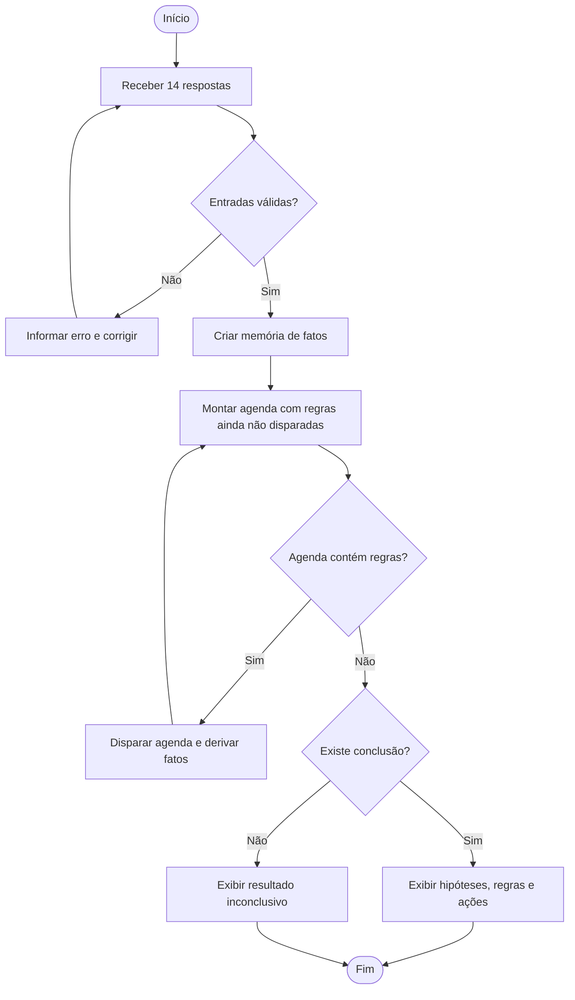
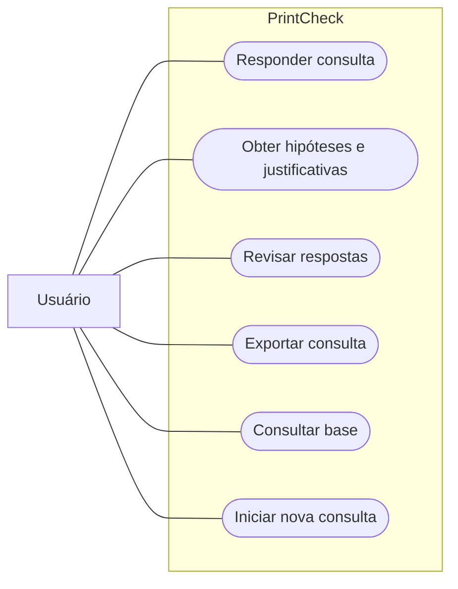
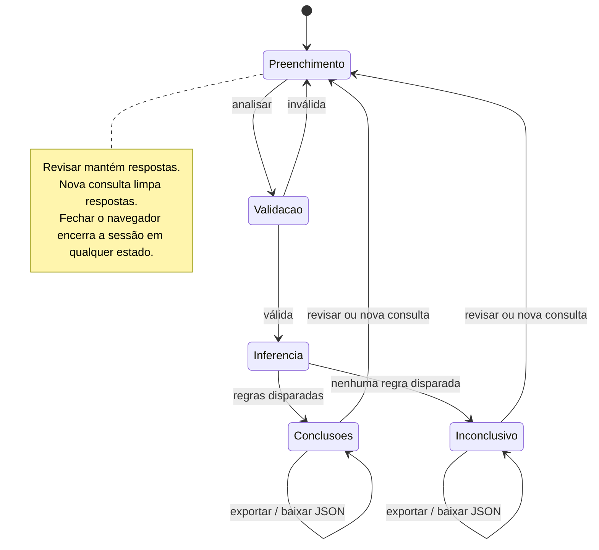

# Diagramas do PrintCheck

## Fluxograma

```mermaid
flowchart TD
 I([Início]) --> Q[Receber 14 respostas]
 Q --> V{Entradas válidas?}
 V -- Não --> E[Informar erro e corrigir]
 E --> Q
 V -- Sim --> M[Criar memória de fatos]
 M --> A[Montar agenda com regras ainda não disparadas]
 A --> H{Agenda contém regras?}
 H -- Sim --> D[Disparar agenda e derivar fatos]
 D --> A
 H -- Não --> C{Existe conclusão?}
 C -- Sim --> R[Exibir hipóteses, regras e ações]
 C -- Não --> N[Exibir resultado inconclusivo]
 R --> F([Fim])
 N --> F
```

## Casos de uso
Representação editável das associações. O PDF apresenta ator e elipses em notação UML.

```mermaid
flowchart LR
 U[Usuário]
 subgraph PrintCheck
  A([Responder consulta])
  B([Obter hipóteses e justificativas])
  C([Revisar respostas])
  D([Exportar consulta])
  E([Consultar base])
  F([Iniciar nova consulta])
 end
 U --- A
 U --- B
 U --- C
 U --- D
 U --- E
 U --- F
```

## Estados de uma consulta

```mermaid
stateDiagram-v2
 [*] --> Preenchimento
 Preenchimento --> Validacao: analisar
 Validacao --> Preenchimento: inválida
 Validacao --> Inferencia: válida
 Inferencia --> Conclusoes: regras disparadas
 Inferencia --> Inconclusivo: nenhuma regra disparada
 Conclusoes --> Preenchimento: revisar ou nova consulta
 Inconclusivo --> Preenchimento: revisar ou nova consulta
 Conclusoes --> Conclusoes: exportar / baixar JSON
 Inconclusivo --> Inconclusivo: exportar / baixar JSON
 note right of Preenchimento
  Revisar mantém respostas.
  Nova consulta limpa respostas.
  Fechar o navegador encerra a sessão em qualquer estado.
 end note
```
